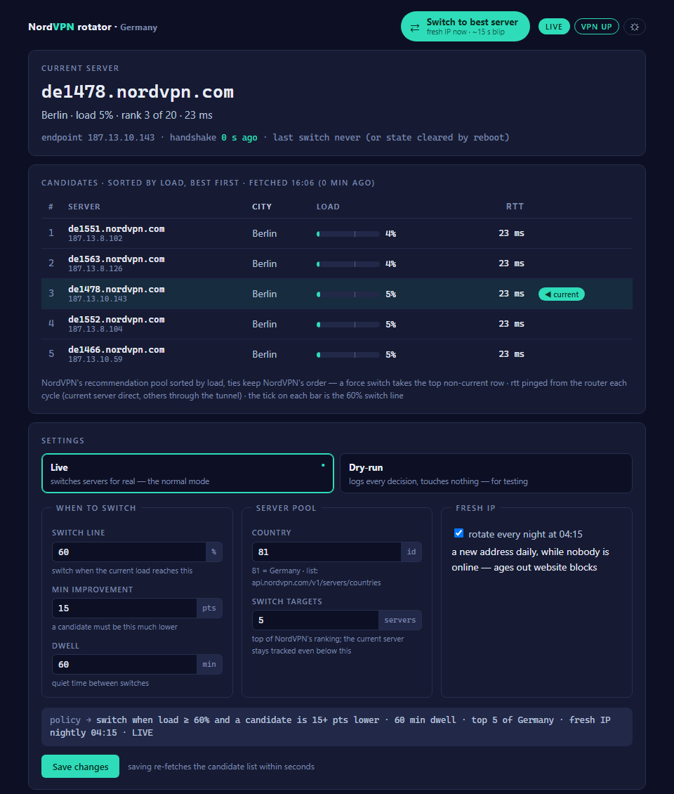
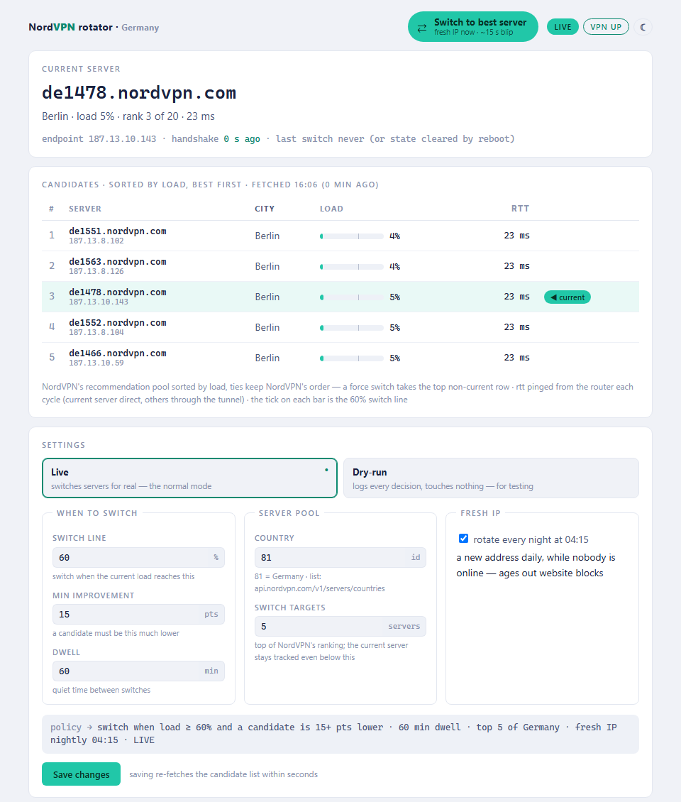

# nordvpn-rotate

A small shell script and dashboard that keep a GL.iNet router on a fast
NordVPN server, instead of the one it happened to pick last month.

| Dark | Light |
|------|-------|
|  |  |

## Why this exists

My whole household's traffic goes through one NordVPN WireGuard tunnel on a
GL.iNet router. The GL panel picks a server once and then never thinks about
it again. A few weeks later that server sits at 70% load, evening streaming
turns into a slideshow, and the VPN everyone pays for feels like dial-up.

NordVPN's phone and desktop apps re-pick servers all the time. Routers don't
get an app. This is the missing piece: a cron job that asks NordVPN's public
recommendations API every 30 minutes whether your server is still a good
idea, and moves the tunnel when the answer is clearly no.

## The version for non-technical people

Think of a VPN server as a checkout lane at the supermarket. Your router
picked a lane once and refuses to change, even when eight people are queuing
in it and the lane next door is empty. This script checks the queues every
half hour and switches lanes when yours is jammed. The internet blips for
about 15 seconds during a switch, and that's the whole cost.

It can also grab a fresh IP address on demand (one button on the dashboard),
which helps when a website has decided it doesn't like the VPN address you
share with a few thousand strangers.

## What it actually does

Every 30 minutes, cron runs one decision cycle:

1. Fetch NordVPN's recommended servers for your country. Public API, no
   account or token needed.
2. Find your current server in that list.
3. Switch only when the current server is at or above the load threshold
   (default 60%) **and** some candidate is at least 15 points lower. Having
   dropped out of the recommended list entirely also counts as a reason.
4. Health-check the new tunnel (WireGuard handshake plus a ping through it).
   If it doesn't come up, roll back to the old server automatically.

There are anti-flap rules so it doesn't bounce around: a minimum dwell time
between switches (default 60 min), the minimum-improvement requirement, and a
cooldown after any failed attempt. A marker file on flash survives reboots,
so a switch interrupted halfway gets repaired on the next cycle.

On top of the load policy, a **nightly rotation** (on by default) grabs a
fresh IP at 04:15 every night regardless of load — websites sometimes block
a shared VPN address, and a daily change ages that out while nobody is
online.

It never touches your WireGuard private key, DNS, MTU, or the kill switch.
The only thing it ever rewrites is the peer's endpoint and public key — the
same change you'd make by clicking a different server in the GL panel.

It runs **live by default**. If you'd rather watch it think first, the
dashboard has a dry-run mode that logs every decision without touching the
tunnel — meant for testing, not as a permanent state.

## Requirements

- A GL.iNet router on firmware 4.x with the NordVPN WireGuard client already
  set up and working in the GL panel. Built and tested on an XE3000
  (firmware 4.8.3); anything with the same `uci`/`ubus`/`jsonfilter` layout
  should behave.
- Nothing else. It uses only tools that ship with the stock firmware.

One gotcha I hit: on the XE3000 the WireGuard client interface is
`wgclient1`, not the `wgclient` most forum posts mention. That's what the
`WG_IFACE` setting is for, and `check` (below) will tell you if it's wrong.

## Install

Upload the four files and run the installer on the router:

```bash
scp -O nordvpn-rotate.sh nordvpn-rotate.conf rotator-dashboard.cgi install.sh root@192.168.8.1:/tmp/nvr/
```

```bash
ssh root@192.168.8.1 "sh /tmp/nvr/install.sh && /usr/bin/nordvpn-rotate.sh check"
```

`check` is a read-only pre-flight that verifies every assumption on your
router (tools present, interface up, peer section found, API reachable) and
prints OK/WARN/FAIL for each.

The rotator starts working right away — live mode is the default. Read its
diary anytime:

```bash
ssh root@192.168.8.1 "tail -f /tmp/nordvpn-rotate.log"
```

Lines like `OK: de1478... load 23% (rank 2 of 20)` mean it's happy and doing
nothing. A `SWITCHED:` line every few days is normal.

## Testing first (optional dry-run)

If you'd rather watch before letting it act: open the dashboard, pick
**Dry-run** in Settings, save. Every decision is then only logged as
`DRY-RUN: would switch ...` and the tunnel is never touched. Flip back to
**Live** when the decisions look sensible. Dry-run log lines are only shown
on the dashboard while dry-run mode is active.

## The dashboard

`http://192.168.8.1/cgi-bin/rotator` — no login, it's your LAN. (Cross-site
requests from the internet are still rejected, so a malicious page can't
press the buttons through your browser.)

What you're looking at, top to bottom:

- **Current server** — hostname, city, load, its load rank, round-trip
  time, handshake age, last switch — and the **Force switch** button for a
  fresh IP on demand.
- **Candidates** — NordVPN's recommendation pool **sorted by load, best
  first** (ties keep NordVPN's order), cut to as many rows as your
  switch-target setting. The rotate script sorts exactly the same way and
  picks the top non-current row, so what a force switch takes is always the
  first candidate you see. The RTT is pinged from the router itself once
  per cycle. If the current server ranks below the displayed targets it's
  appended at the bottom with its real rank, so it never disappears from
  the board.
- **Settings** — mode (Live / Dry-run), the switch policy, server pool and
  nightly rotation, with a live one-line preview of the policy you're about
  to save. Saving shows an animated "applying" banner and the page polls
  itself until the re-fetched candidate list lands (a few seconds) — same
  for Force switch, which reports back when the switch has finished.
- **Switch history / recent activity** — the log, colour-coded, newest
  first. Dry-run chatter appears only while dry-run mode is active.

The moon/sun button toggles dark and light mode; the choice sticks per
browser. The page refreshes itself every 60 seconds but politely waits while
you're typing in a settings field.

## Configuration

Everything lives in `/etc/nordvpn-rotate.conf` (shell syntax) and is also
editable from the dashboard.

| Key | Default | Meaning |
|-----|---------|---------|
| `DRY_RUN` | `0` | 0 = live (default). 1 = log decisions only — testing mode. |
| `COUNTRY_ID` | `81` | NordVPN country id (81 = Germany). List: `api.nordvpn.com/v1/servers/countries` |
| `LOAD_THRESHOLD` | `60` | Switch when the current server's load reaches this % |
| `MIN_IMPROVEMENT` | `15` | ...and a candidate is at least this many points lower |
| `MIN_DWELL_MIN` | `60` | Never switch again within this many minutes |
| `CANDIDATES` | `20` | How many top-ranked servers are switch targets (min. 20 are always fetched so the current server stays tracked) |
| `NIGHTLY_ROTATE` | `1` | 1 = rotate every night at 04:15 for a fresh IP (default on) |
| `WG_IFACE` | `wgclient` | WireGuard client interface (`wgclient1` on the XE3000) |

## Commands

```
nordvpn-rotate.sh run      # one decision cycle (what cron calls)
nordvpn-rotate.sh force    # switch to the best candidate NOW (fresh IP)
nordvpn-rotate.sh nightly  # like force, but only if NIGHTLY_ROTATE=1
nordvpn-rotate.sh refresh  # re-fetch candidates/latency only, switch nothing
nordvpn-rotate.sh check    # read-only pre-flight, run this first
nordvpn-rotate.sh status   # current server, last switch, recent log
```

`force` skips the load and dwell gates but keeps the health check and
rollback, and it respects dry-run. `force` and `nightly` also wait for a
running cycle to finish instead of silently giving up, take a loaded
candidate rather than skip the fresh IP, and reuse a candidate list newer
than 10 minutes — so a forced switch takes exactly the server the dashboard
was showing, and starts immediately.

## Testing

`test/run-local.sh` runs the real scripts on a normal PC with every router
command mocked (`uci`, `ubus`, `wg`, `ping`, ...) — a lean suite covering the
switch logic, rollback, recovery after interrupted switches, the lock
collision, small candidate counts, and the dashboard rendering and POST
handling. It runs fine in Git Bash on Windows; you need `python` on the
PATH.

```bash
sh test/run-local.sh
```

If you want a proper package instead of loose files, `package/build-ipk.sh`
builds an opkg-installable `.ipk`.

## Uninstall

```bash
ssh root@192.168.8.1 "sh /tmp/nvr/install.sh uninstall"
```

Removes the script, conf, cron lines, dashboard and state. The WireGuard
peer keeps whatever endpoint it had last; pick a server in the GL panel if
you want a specific one back.

## Fine print

- The recommendations API is public but not officially documented for third
  parties. If NordVPN changes the format, the script refuses to act rather
  than guessing (it parses defensively and dies loudly).
- GL.iNet firmware upgrades tend to wipe `/usr/bin` extras and the crontab.
  The installer registers everything in `/etc/sysupgrade.conf`, but GL
  doesn't guarantee honoring it — keep the files around and re-run
  `install.sh` after an upgrade.
- All German NordVPN servers currently share one WireGuard public key, so a
  switch is just an endpoint change. The script still updates the key when
  it differs, so other countries should work too.
- This moves your traffic between NordVPN's servers. It can't make a bad
  line good — it just stops you from staying in the slowest queue.

MIT licensed. Built for my own router; issues and PRs welcome, but I can
only test on GL.iNet 4.x.
